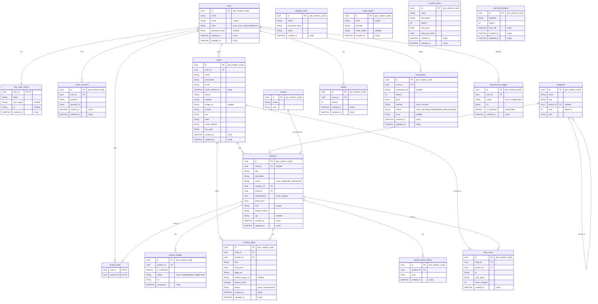

# Kalamche

A RESTful product search & price-comparison engine — the same idea as Torob: sellers list products, buyers search and compare prices across sellers, and clicks on an offer are tracked back to the seller.

The project is implemented **twice**, on purpose, with the same feature set: once in **NestJS/TypeScript** and once in **Rust**. The main goal of the Rust twin is to compare the two stacks/architectures side by side, not to ship two production services.

> This is a personal/portfolio project built solo. It is **not feature-complete** and not production-hardened — see [Project Status](#project-status) before judging it as "done" or trying to run it in prod.

---

## Project Status

This project is a work in progress, built alone in limited time. Please read this before diving into the code:

- Several routes are **not implemented**, including some CRUD endpoints, two-factor auth, and parts of the users module.
- Some previously-working CRUDs/code paths were **removed** to match the current frontend's state (frontend and backend are not 100% in sync).
- The Kafka event pipeline is intentionally **bare-bones** (see [Kafka Events](#kafka-events--search-indexing)) — it is missing things like a dead-letter queue and idempotent consumers because I didn't have time to build them myself and couldn't find a package I was happy with.
- Product **price history logging** and **like/view count** Kafka events are **not implemented**. An earlier version of the project had this, but it was removed.
- Shop creation has **no admin approval / email verification** step — again, a scope cut due to time, not a design decision I'd defend for production.

In short: treat this as a working proof-of-concept / architecture sandbox, not a finished product.

---

## Tech Stack

- **Framework:** NestJS (Express adapter)
- **Language:** TypeScript
- **Database:** PostgreSQL + Drizzle ORM
- **Search:** Meilisearch
- **Messaging:** Kafka (NestJS microservices module)
- **Object storage:** S3-compatible storage (RustFS locally, AWS S3-compatible in general)
- **Auth:** Access/refresh tokens, email+password, email OTP, OAuth (Discord, GitHub)
- **Email templating:** Handlebars (hbs)
- **Payments:** Multi-provider, with Zarinpal as the default provider
- **Error tracking:** Sentry
- **Testing:** Vitest

---

## How Things Work

### Authentication & Authorization

- Supports email/password login, email OTP, and OAuth (Discord and GitHub) as multiple ways to authenticate into the same account system.
- Access/refresh token pair issued on login.
- A custom **RBAC (role-based access control)** system gates every route by role.
- Emails (verification, OTP, notifications, etc.) are rendered from **Handlebars templates**.

### Rate Limiting

A custom rate-limiting "bucket" system is applied per module. Buckets can be keyed by:
- IP address
- User ID
- Auth token

This lets different endpoints apply different limiting strategies depending on whether the caller is anonymous, authenticated, or acting on behalf of a specific token.

### Anonymous Image Upload

Images (for shops and products) go through a standalone, **anonymous upload flow**:

1. A user uploads an image without needing to already have a shop/product to attach it to.
2. The upload is resized using a **multithreaded image-resize** step.
3. The server returns an **image ID**, which is later referenced when creating/updating a shop or product.
4. Any uploaded image that never gets attached to a shop/product is **auto-deleted after 24 hours** via an S3 lifecycle rule — this keeps orphaned uploads from piling up without needing a manual cleanup job.

### Shops

- Each user account can own **at most one shop**.
- There is currently no admin-approval or email-verification step for shop creation (see [Project Status](#project-status)).

### Products, Duplicate Detection & Buybox

Products are deduplicated using identifying codes: **model number / UPC / ASIN**.

- When a shop wants to sell a product, the system checks whether a product with that identifier already exists.
  - If it **doesn't exist**, the shop's listing creates the canonical `Product` record.
  - If it **already exists**, the shop instead creates an **offer** against that existing product.
- Every product can have multiple offers (one per shop). The system computes a **"buybox winner"**: the offer with the lowest price among all offers for that product. This is the offer shown as the "best price" and is what search/similar-product logic uses as the product's representative price.

### Search & Similar Products (Meilisearch)

Both product search and the "similar products" feature run on Meilisearch instead of querying Postgres directly.

- **Search** supports free-text query, sorting (cheapest/expensive/newest/popular/most-viewed), and filtering by one of price range, category, or brand at a time. It also returns price stats and related brands for the current result set, to power UI filters.
- **Similar products** looks for other products in the same category, within roughly ±30% of the item's current best price, preferring the same brand first and falling back to other brands if there aren't enough matches. There's an open idea to link brands to categories directly so this fallback is needed less often.
- Both use a simple "fetch one extra item" trick to know whether there's a next page.

### Kafka Events & Search Indexing

Product create/update/delete events are pushed onto Kafka and consumed to keep the Meilisearch index in sync with Postgres.

This is intentionally a **minimal** NestJS microservices Kafka setup:
- No dead-letter queue.
- No idempotent-consumer/exactly-once handling.
- Price-history logging and like/view-count update events are **not wired up** (they existed in an earlier version and were removed).

This was a scope/time trade-off, not an architectural recommendation — a production version of this would need at least a DLQ and idempotency keys on consumers.

### FR Tokens (Offer/Click Budget) & Payments

Shops purchase a balance of **"FR tokens"** to keep an offer active — conceptually similar to buying ad clicks (e.g. Google Ads):

- Each offer is backed by a token balance.
- Every time a buyer clicks through to that offer's redirect URL, one (or more) tokens are **consumed**.
- Once a shop's tokens for an offer run out, the offer effectively stops being promoted/redirectable until it's topped up.
- Tokens are purchased through a **multi-provider payment system**, with **Zarinpal** as the default/primary provider.

---

## Database

View the dbdocs diagram [here](https://dbdocs.io/ashkanhaghdoost01/kalamche)



---

## API Documentation

A full Postman collection is included in [`/docs`](./docs) in this repository — import it into Postman to explore and try every implemented route.

---

## Getting Started

### Prerequisites

- Docker & Docker Compose
- Node.js/Pnpm & Bun (used for the seed script; Node.js works for everything else)

### 1. Start infrastructure

The `docker-compose.yml` in this repo spins up everything the API depends on:

| Service | Purpose | Ports |
|---|---|---|
| `postgres` | Primary database | `5432` |
| `s3` (RustFS) | S3-compatible object storage for images | `9000` (API), `9001` (console) |
| `meilisearch` | Product search index | `7700` |
| `kafka-broker` | Event bus (KRaft mode, single node) | `9092` |
| `kafka-init` | One-off container that creates required Kafka topics | – |
| `mailhog` | Local SMTP catcher for testing emails | `1025` (SMTP), `8025` (web UI) |

```bash
docker compose up -d
```

### 2. Configure environment

Copy `.env.example` to `.env` (if present) and fill in the values referenced by `docker-compose.yml`.
Plus whatever app-level config the NestJS app expects for OAuth providers (Discord/GitHub), Zarinpal, and Sentry.

### 3. Install dependencies

```bash
pnpm install # or npm install / pnpm install
```

### 4. Set up the database

```bash
pnpm db:push     # push the Drizzle schema to Postgres
pnpm db:seed     # seed dev/test data + demo product CSV
```

The seed script is built to be **self-contained**: run it once against a fresh database and you get a ready-to-use dataset (shops, products, offers, categories/brands) without any manual setup, using a bundled product CSV.

### 5. Run the app

```bash
pnpm start:dev
```
---

## Known Limitations

- Missing/incomplete: several CRUD routes, two-factor authentication, some user-management endpoints.
- Kafka pipeline has no DLQ or idempotent consumer handling.
- No price-history logging or like/view Kafka events (removed from an earlier version).
- No admin approval / email verification on shop creation.
- Some routes present in earlier versions were removed to stay in sync with the current frontend.
